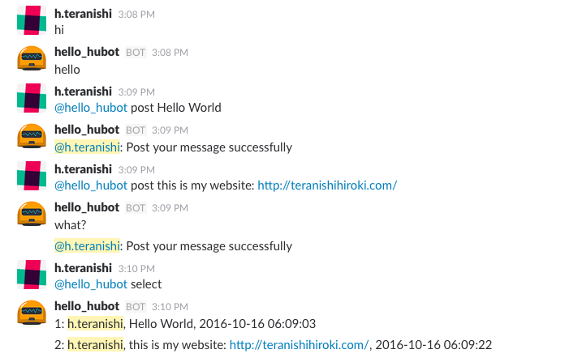
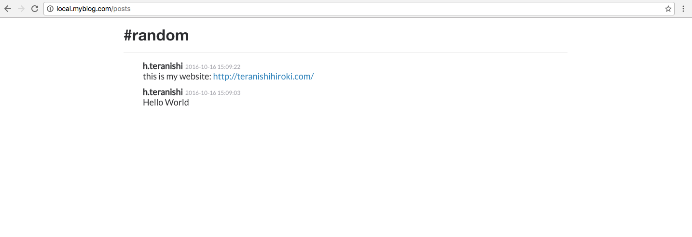
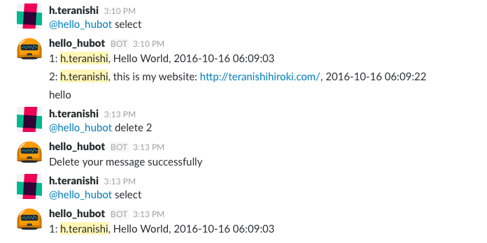
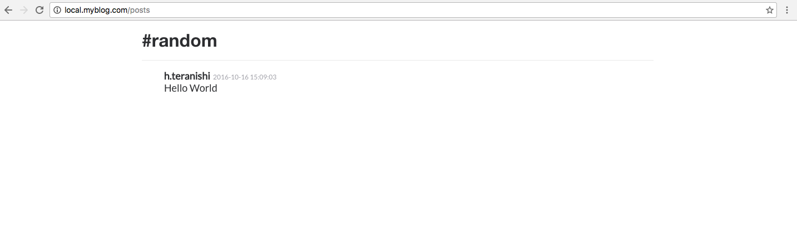

# microblog

Minimal micro blogging app via Slack.

## Installation

### 1. Slack hubot application

```sh
$ git https://github.com/chantera/microblog
$ cd microblog/db
$ sqlite3 app.db < app.schema
$ cd ../app
$ npm install
```

### 2. Web application  * local install

```sh
$ sudo vi /etc/apache2/extra/httpd-vhosts.conf

<VirtualHost *:80>
    DocumentRoot "/Users/yourname/Sites/myblogweb/"
    ServerName local.myblog.com
    <Directory "/Users/yourname/Sites/myblogweb/">
        Require all granted
        DirectoryIndex index.php
    </Directory>
</VirtualHost>

$ sudo vi /etc/hosts

127.0.0.1	local.myblog.com

$ cd ~/Sites
$ ln -s [microblog-repo]/webroot ./myblogweb
$ sudo apachectl restart
```

## Usage

### 1. Start hubot on Slack

```sh
$ cd [microblog-repo]/app
$ export HUBOT_SLACK_TOKEN=your-hubot-slack-token
$ bin/hubot start
```

### 2. Post your message via Slack

```sh
@your_hubot post your-message-here
```



Then you can see your posts at : http://local.myblog.com/posts



You can delete your post by following command:

```sh
@your_hubot select
@your_hubot delete post-id
```





License
----
Apache License Version 2.0

&copy; Copyright 2016 Teranishi Hiroki
